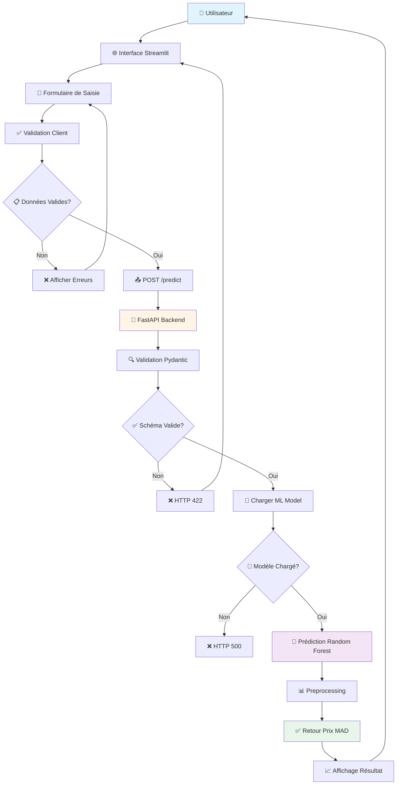
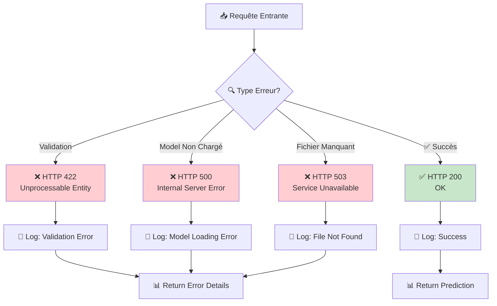
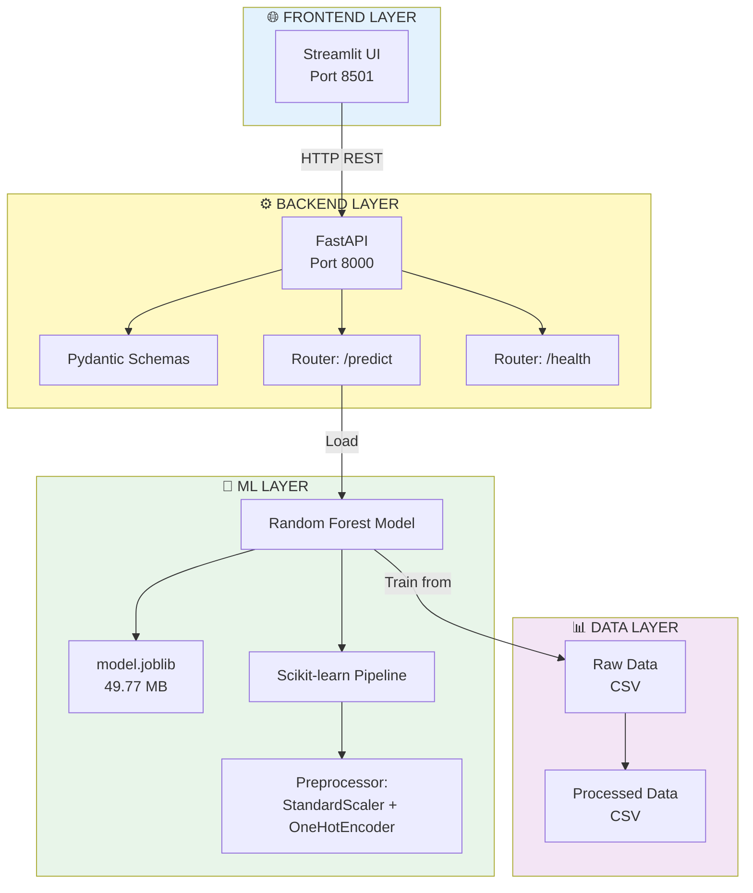

# 🚗 Car Price Prediction

<div align="center">

[](https://www.python.org/downloads/)
[](https://fastapi.tiangolo.com)
[](https://streamlit.io)
[](https://scikit-learn.org)
[](https://www.docker.com)
[](LICENSE)

**Application complète de Machine Learning pour estimer le prix des voitures d'occasion au Maroc**

[📖 Documentation](#-table-des-matières) • [🚀 Installation](#-installation) • [💻 Utilisation](#-utilisation)

</div>

---

## 📋 Table des Matières

- [Vue d'ensemble](#-vue-densemble)
- [Architecture du Projet](#️-architecture-du-projet)
- [Structure des Dossiers](#-structure-des-dossiers)
- [Technologies Utilisées](#-technologies-utilisées)
- [Fonctionnalités](#-fonctionnalités)
- [Installation](#-installation)
- [Utilisation](#-utilisation)
- [API Documentation](#-api-documentation)
- [Métriques et Performance](#-métriques-et-performance)
- [Tests](#-tests)
- [Déploiement](#-déploiement)
- [Contributeur](#-contributeur)
- [Licence](#-licence)

---

## 🎯 Vue d'ensemble

**Car Price Prediction** est une application full-stack de Machine Learning qui permet d'estimer le prix réel d'une voiture d'occasion au Maroc à partir de ses caractéristiques techniques et de son état.

### Problématique

Le marché des voitures d'occasion au Maroc manque de transparence dans la tarification. Les acheteurs ont du mal à déterminer si le prix proposé est juste.

### Solution

Une application web complète avec:
- 🎯 **Estimation précise** basée sur Random Forest
- ⚡ **API REST** avec FastAPI
- 💻 **Interface intuitive** Streamlit
- 🐳 **Docker ready**
- 📊 **Architecture modulaire** et extensible

---

## 🏗️ Architecture du Projet

### 📐 Architecture Globale en Couches

```
┌─────────────────────────────────────────────────────────────────┐
│                    COUCHE PRÉSENTATION                          │
│  ┌───────────────────────────────────────────────────────────┐  │
│  │              Streamlit Frontend (Port 8501)               │  │
│  │  ┌──────────┐  ┌──────────┐  ┌──────────┐                │  │
│  │  │ Input    │  │ Display  │  │  Error   │                │  │
│  │  │ Form     │  │ Results  │  │ Handling │                │  │
│  │  └──────────┘  └──────────┘  └──────────┘                │  │
│  └───────────────────────────────────────────────────────────┘  │
└──────────────────────────┬──────────────────────────────────────┘
                           │
                           │ HTTP REST API (JSON)
                           │
┌──────────────────────────┴──────────────────────────────────────┐
│                    COUCHE APPLICATION                           │
│  ┌───────────────────────────────────────────────────────────┐  │
│  │              FastAPI Backend (Port 8000)                  │  │
│  │                                                           │  │
│  │  ┌──────────┐  ┌──────────┐  ┌──────────┐               │  │
│  │  │ /predict │  │ /health  │  │    /     │               │  │
│  │  └────┬─────┘  └────┬─────┘  └────┬─────┘               │  │
│  │       │             │              │                      │  │
│  │  ┌────▼────────────────────────────▼─────┐               │  │
│  │  │        Middleware Layer                │               │  │
│  │  │  - CORS                                │               │  │
│  │  │  - Error Handling                      │               │  │
│  │  │  - Request Validation                  │               │  │
│  │  └────────────────────────────────────────┘               │  │
│  └───────────────────────────────────────────────────────────┘  │
└──────────────────────┬──────────┬──────────┬────────────────────┘
                       │          │          │
         ┌─────────────┴──┐  ┌────┴────┐  ┌─┴────────────┐
         │                │  │         │  │              │
┌────────▼─────────┐  ┌──▼──▼──────┐  │  ┌▼──────────────▼──────┐
│  COUCHE DATA     │  │COUCHE LOGIC│  │  │  COUCHE PERSISTENCE   │
│                  │  │            │  │  │                      │
│  ┌────────────┐  │  │ ┌────────┐ │  │  │  ┌────────────────┐ │
│  │   CSV      │  │  │ │   ML   │ │  │  │  │  Model Loader  │ │
│  │   Files    │  │  │ │ Model  │ │  │  │  │                │ │
│  │            │  │  │ │        │ │  │  │  │  model.joblib  │ │
│  └────────────┘  │  │ └────────┘ │  │  │  │  49.77 MB      │ │
│                  │  │            │  │  │  └────────────────┘ │
│  - Raw Data      │  │ Random     │  │  │                    │
│  - Processed     │  │ Forest     │  │  │  Lazy Loading      │
└──────────────────┘  └────────────┘  │  └─────────────────────┘
                                      │
┌─────────────────────────────────────┘
│         COUCHE TRAÇABILITÉ
│  ┌────────────────────────────────┐
│  │    Model Versioning             │
│  │  - Joblib Serialization         │
│  │  - Pipeline Persistence         │
│  └────────────────────────────────┘
└────────────────────────────────────
```

### 🔄 Diagramme de Séquence - Flux de Prédiction

```
Utilisateur    Frontend     Backend      Model Loader    ML Model
    │             │            │           │              │
    │  1. Saisie  │            │           │              │
    │─────────────>│            │           │              │
    │             │            │           │              │
    │             │ 2. POST    │           │              │
    │             │  /predict  │           │              │
    │             │────────────>│           │              │
    │             │            │           │              │
    │             │            │ 3. Load   │              │
    │             │            │  Model    │              │
    │             │            │───────────>│              │
    │             │            │           │              │
    │             │            │           │ 4. Load      │
    │             │            │           │  from disk   │
    │             │            │           │──────────────>│
    │             │            │           │              │
    │             │            │           │ 5. Model     │
    │             │            │           │  Loaded      │
    │             │            │<───────────│              │
    │             │            │           │              │
    │             │            │ 6. Predict│              │
    │             │            │──────────────────────────>│
    │             │            │           │              │
    │             │            │ 7. Price  │              │
    │             │            │<──────────────────────────│
    │             │            │           │              │
    │             │ 8. JSON    │           │              │
    │             │  Response  │           │              │
    │             │<────────────│           │              │
    │             │            │           │              │
    │ 9. Afficher │            │           │              │
    │<─────────────│            │           │              │
    │             │            │           │              │
```

### 🌐 Diagramme de Déploiement Docker

```
┌────────────────────────────────────────────────────────────────┐
│                      Docker Network: car_net                  │
│                                                                │
│  ┌──────────────────┐         ┌──────────────────┐            │
│  │  Frontend        │         │  Backend         │            │
│  │  Container       │         │  Container       │            │
│  │                  │         │                  │            │
│  │  Streamlit       │<──REST──│  FastAPI         │            │
│  │  Port: 8501      │         │  Port: 8000      │            │
│  │                  │         │                  │            │
│  │  Image:          │         │  Image:          │            │
│  │  python:3.11     │         │  python:3.11     │            │
│  └──────────────────┘         └────────┬─────────┘            │
│                                        │                       │
│                                        │                       │
│                          ┌─────────────▼─────────────┐         │
│                          │                           │         │
│                          │  ┌─────────────────────┐  │         │
│                          │  │  ML Model          │  │         │
│                          │  │  (In Backend)      │  │         │
│                          │  │                    │  │         │
│                          │  │  model.joblib      │  │         │
│                          │  │  Volume Mount      │  │         │
│                          │  │  /app/models       │  │         │
│                          │  └─────────────────────┘  │         │
│                          │                           │         │
│                          └───────────────────────────┘         │
│                                                                │
│  Volume Mounts:                                                │
│  - ../models → /app/models                                     │
└────────────────────────────────────────────────────────────────┘
```

### 📡 Communication entre Services

```
┌──────────────────────────────────────────────────────────┐
│                   FLUX DE DONNÉES                        │
└──────────────────────────────────────────────────────────┘

Requête Utilisateur
       │
       ▼
┌──────────────┐  Port 8501
│  Streamlit   │  Protocol: HTTP
│  Frontend    │  Format: Form Data
└──────┬───────┘
       │
       │ [POST /predict]
       │ Content-Type: application/json
       │ Body: CarFeatures
       │
       ▼
┌──────────────┐  Port 8000
│   FastAPI    │  Protocol: HTTP REST
│   Backend    │  Format: JSON
└──┬───────┬──┘
   │       │
   │       └──────────────────┐
   │                         │
   │ [Load Model]            │
   │                         │
   ▼                         │
┌──────────────┐             │
│ Model Loader │             │
│              │             │
│  Lazy Load   │             │
│  joblib      │             │
└──────┬───────┘             │
       │                     │
       │ [Predict]           │
       │                     │
       ▼                     │
┌──────────────┐             │
│  ML Model    │             │
│Random Forest │             │
│              │             │
│  Pipeline:   │             │
│  - Preprocess│             │
│  - Predict   │             │
└──────┬───────┘             │
       │                     │
       │ [Return Price]       │
       │                     │
       ▼                     │
┌──────────────┐             │
│ Response to  │             │
│  Frontend    │             │
└──────────────┘             │
       │                     │
       └─────────────────────┘

LÉGENDE:
━━━━  Communication HTTP/REST
```

### 🔐 Sécurité et Validation

```
┌───────────────────────────────────────────────────┐
│            PIPELINE DE VALIDATION                 │
└───────────────────────────────────────────────────┘

Input (Frontend)
     │
     │ [User Input]
     │
     ▼
┌─────────────────┐
│ Client-Side     │
│ Validation      │
│ - Required      │
│ - Format        │
│ - Range         │
└────────┬────────┘
         │
         │ [Valid]
         │
         ▼
┌─────────────────┐
│ HTTP POST       │
│ with JSON       │
└────────┬────────┘
         │
         ▼
┌─────────────────┐
│ FastAPI         │
│ Pydantic Schema │
│ - Type Check    │
│ - Field Validate│
│ - Year: 1990-   │
│   2025          │
└────────┬────────┘
         │
         │ [Valid]
         │
         ▼
┌─────────────────┐
│ Business Logic  │
│ - Load Model    │
│ - Preprocess    │
│ - Predict       │
└────────┬────────┘
         │
         ▼
    Response
```

### 🎨 Diagrammes de Flux Interactifs (Mermaid)

#### 📊 Flux Principal de Prédiction



#### 🔄 Flux d'Entraînement du Modèle


#### ⚠️ Flux de Gestion des Erreurs



#### 🏗️ Architecture des Composants



---

## 📁 Structure des Dossiers

```
car-price-prediction/
│
├── 📂 data/                         # Données
│   ├── raw/                         # Données brutes
│   │   └── car_data.csv             # Dataset original
│   ├── processed/                   # Données nettoyées
│   │   └── car_data_cleaned.csv     # Dataset prêt pour ML
│   └── README.md                    # Documentation données
│
├── 📂 src/                          # Code source
│   ├── api/                         # Backend FastAPI
│   │   ├── main.py                 # Application principale
│   │   ├── model_loader.py          # Chargement modèle
│   │   ├── schemas.py               # Schémas Pydantic
│   │   ├── routers/                 # Routes API
│   │   │   ├── predict.py          # Endpoint prédiction
│   │   │   └── health.py            # Health check
│   │   └── requirements.txt        # Dépendances backend
│   │
│   ├── frontend/                    # Frontend Streamlit
│   │   ├── app.py                   # Interface web
│   │   └── requirements.txt         # Dépendances frontend
│   │
│   └── ml/                          # Machine Learning
│       ├── train_model.py           # Script d'entraînement
│       └── utils.py                 # Utilitaires ML
│
├── 📂 models/                        # Modèles entraînés
│   └── car_price_model.joblib       # Modèle Random Forest
│
├── 📂 notebooks/                     # Jupyter Notebooks
│   └── car_price_pipeline.ipynb     # Pipeline ML
│
├── 📂 docker/                       # Configuration Docker
│   ├── Dockerfile.backend           # Image backend
│   ├── Dockerfile.frontend          # Image frontend
│   └── docker-compose.yml           # Orchestration
│
├── 📂 tests/                        # Tests unitaires
│   ├── test_api.py                  # Tests API
│   ├── test_model.py                # Tests modèle
│   └── test_data.py                 # Tests données
│
├── 📄 requirements.txt              # Dépendances principales
├── 📄 Makefile                      # Commandes automatisées
└── 📄 README.md                       # Ce fichier
```

---

## 🛠️ Technologies Utilisées

### Backend
- **FastAPI** - Framework web moderne et rapide
- **Uvicorn** - Serveur ASGI haute performance
- **Pydantic** - Validation de données et schémas

### Frontend  
- **Streamlit** - Interface web interactive pour ML
- **Requests** - Client HTTP pour API

### Machine Learning
- **scikit-learn** - Framework ML (Random Forest)
- **Pandas** - Manipulation et analyse de données
- **NumPy** - Calculs numériques
- **Joblib** - Sérialisation de modèles

### DevOps
- **Docker** - Containerisation
- **Docker Compose** - Orchestration de services

### Outils
- **Python 3.8+** - Langage de programmation

---

## ✨ Fonctionnalités

### 🎯 Prédiction de Prix
✅ Estimation basée sur 13+ caractéristiques  
✅ Modèle Random Forest optimisé  
✅ Validation temps réel avec Pydantic  
✅ Gestion des erreurs robuste  
✅ Prix en Dirhams marocains (MAD)

### ⚡ Performance
✅ Architecture modulaire et extensible  
✅ Lazy loading du modèle  
✅ Pipeline de preprocessing intégré  
✅ Gestion mémoire optimisée

### 📊 Caractéristiques Prédites
- **Marque** (company)
- **Modèle** (model)
- **Édition** (edition)
- **Année** (year)
- **Propriétaire** (owner)
- **Carburant** (fuel)
- **Type de vendeur** (seller_type)
- **Transmission** (transmission)
- **Kilométrage** (km_driven)
- **Consommation** (mileage_mpg)
- **Cylindrée** (engine_cc)
- **Puissance** (max_power_bhp)
- **Couple** (torque_nm)
- **Sièges** (seats)

### 🧪 Tests
✅ Tests unitaires pour API  
✅ Tests de validation des données  
✅ Tests du modèle ML

---

## 🚀 Installation

### Option 1: Installation Locale

```bash
# Cloner le repository
git clone https://github.com/AyoubFaradi/car-price-prediction.git
cd car-price-prediction

# Créer un environnement virtuel
python -m venv venv
source venv/bin/activate  # Sur Windows: venv\Scripts\activate

# Installer les dépendances
pip install -r requirements.txt
pip install -r src/api/requirements.txt
pip install -r src/frontend/requirements.txt

# Entraîner le modèle (si pas déjà fait)
python src/ml/train_model.py
```

### Option 2: Docker (Recommandé)

```bash
# Lancer avec Docker Compose
cd docker
docker-compose up --build

# Services disponibles:
# - Backend: http://localhost:8000
# - Frontend: http://localhost:8501
```

### Option 3: Démarrage Manuel

**Terminal 1 - Backend API :**
```bash
cd src/api
uvicorn main:app --reload --port 8000
```

**Terminal 2 - Frontend :**
```bash
cd src/frontend
streamlit run app.py
```

---

## 🎯 Utilisation

### Interface Web

1. Ouvrir http://localhost:8501
2. Remplir le formulaire avec les caractéristiques de la voiture
3. Cliquer sur "Prédire le prix 💰"
4. Obtenir le prix estimé en MAD

### API REST

#### Endpoint de Prédiction

```bash
curl -X POST "http://localhost:8000/predict" \
  -H "Content-Type: application/json" \
  -d '{
    "company": "Maruti",
    "model": "Swift",
    "edition": "VDI",
    "year": 2014,
    "owner": "First",
    "fuel": "Diesel",
    "seller_type": "Individual",
    "transmission": "Manual",
    "km_driven": 145500,
    "mileage_mpg": 25.2,
    "engine_cc": 1248.0,
    "max_power_bhp": 74.0,
    "torque_nm": 190.0,
    "seats": 5
  }'
```

**Réponse:**
```json
{
  "estimated_price_MAD": 54000.0
}
```

#### Health Check

```bash
curl http://localhost:8000/health
```

**Réponse:**
```json
{
  "status": "API is running ✅"
}
```

---

## 📚 API Documentation

### Endpoints

| Endpoint | Méthode | Description | Exemple |
|----------|---------|-------------|---------|
| `/` | GET | Message de bienvenue | `{"message": "Bienvenue..."}` |
| `/predict` | POST | Prédire le prix | Voir ci-dessus |
| `/health` | GET | État du système | `{"status": "API is running ✅"}` |

### Documentation Interactive

- **Swagger UI**: http://localhost:8000/docs
- **ReDoc**: http://localhost:8000/redoc

### Schéma de Validation

Le schéma Pydantic valide automatiquement :
- Types de données (int, float, str)
- Plages de valeurs (année: 1990-2025)
- Champs requis
- Formats de données

---

## 📊 Métriques et Performance

### Métriques du Modèle ML

Les métriques suivantes sont calculées et suivies :

- **R² Score (Coefficient de détermination)** : Mesure la qualité de l'ajustement du modèle
- **MAE (Mean Absolute Error)** : Erreur moyenne absolue en MAD
- **RMSE (Root Mean Squared Error)** : Erreur quadratique moyenne
- **MAPE (Mean Absolute Percentage Error)** : Erreur en pourcentage

### Métriques à Implémenter

- [ ] **Tracking des métriques** : Logging automatique des métriques après entraînement
- [ ] **Validation croisée** : K-fold cross-validation pour évaluer la robustesse
- [ ] **Feature importance** : Analyse de l'importance des caractéristiques
- [ ] **Métriques de distribution** : Analyse des résidus et distribution des erreurs
- [ ] **Comparaison de modèles** : Test de différents algorithmes (XGBoost, Gradient Boosting, etc.)

### Métriques API

- [ ] **Latence** : Temps de réponse moyen des endpoints
- [ ] **Throughput** : Nombre de requêtes par seconde
- [ ] **Taux d'erreur** : Pourcentage de requêtes échouées
- [ ] **Monitoring** : Intégration avec Prometheus/Grafana

### Métriques de Données

- [ ] **Qualité des données** : Taux de valeurs manquantes, outliers
- [ ] **Distribution des features** : Statistiques descriptives
- [ ] **Drift detection** : Détection de dérive des données

---

## 🧪 Tests

```bash
# Exécuter tous les tests
pytest tests/ -v

# Tests avec couverture
pytest tests/ --cov=src --cov-report=html

# Tests spécifiques
pytest tests/test_api.py -v
pytest tests/test_model.py -v
pytest tests/test_data.py -v
```

### Tests Inclus

- ✅ Tests endpoints API
- ✅ Tests validation schémas Pydantic
- ✅ Tests health check
- ✅ Tests prédictions
- ✅ Tests validation données

---

## 🐳 Docker

### Services Docker

Le projet utilise Docker Compose pour orchestrer deux services :

1. **Backend** (`car_api`) : API FastAPI sur le port 8000
2. **Frontend** (`car_ui`) : Interface Streamlit sur le port 8501

### Commandes Docker

```bash
# Démarrer les services
cd docker
docker-compose up -d

# Voir les logs
docker-compose logs -f

# Arrêter les services
docker-compose down

# Reconstruire les images
docker-compose up --build

# Voir les services en cours
docker-compose ps
```

### Configuration Docker

Les Dockerfiles sont optimisés pour :
- ✅ Images légères (Python slim)
- ✅ Cache des dépendances
- ✅ Variables d'environnement
- ✅ Volumes pour les modèles

---

## 🔄 CI/CD (À Implémenter)

### 🚀 Pipeline Automatisé

Suggestions pour GitHub Actions :

```yaml
# .github/workflows/ci.yml
- Tests automatiques
- Linting (Flake8, Black)
- Build Docker
- Déploiement automatique
```

### 📊 Badges de Statut

- [ ] CI/CD Status
- [ ] Test Coverage
- [ ] Code Quality
- [ ] Security Scan

---

## 🚀 Déploiement

### Options de Déploiement

1. **Docker Compose** (Local/Production)
2. **Cloud Platforms** (AWS, GCP, Azure)
3. **Container Orchestration** (Kubernetes)
4. **Serverless** (AWS Lambda, Google Cloud Functions)

### Variables d'Environnement

```bash
# Backend
API_URL=http://localhost:8000

# Frontend
STREAMLIT_SERVER_PORT=8501
```

---

## 🔮 Améliorations Futures

- [ ] Ajout de plus de modèles ML (XGBoost, Neural Networks)
- [ ] Interface d'administration pour le monitoring
- [ ] Cache Redis pour améliorer les performances
- [ ] Authentification et autorisation
- [ ] Historique des prédictions
- [ ] Export des résultats en PDF/Excel
- [ ] Intégration CI/CD avec GitHub Actions
- [ ] Déploiement sur cloud (AWS, GCP, Azure)
- [ ] Monitoring avec Prometheus + Grafana
- [ ] Logging structuré avec ELK Stack

---

## 👨‍💻 Contributeur

<div align="center">

### Ayoub Faradi

[](https://github.com/AyoubFaradi)
[](https://www.linkedin.com/in/ayoub-faradi)

**Développeur Web Full Stack | Intelligence Artificielle | Cloud & DevOps**

Passionné par le Machine Learning et le développement d'applications intelligentes.

🎓 Diplômé en **Développement Informatique** (_Mention Très Bien_)  
🧠 Curieux, passionné par la **création de solutions web, mobiles et intelligentes**  
⚙️ Expérience avec **l'intégration continue**, **Docker**, et la **gestion de projets Agile**

</div>

---

## 📄 Licence

Ce projet est sous licence MIT - voir le fichier [LICENSE](LICENSE) pour plus de détails.

---

## 📞 Contact

- 🐙 GitHub: [@AyoubFaradi](https://github.com/AyoubFaradi)
- 💼 LinkedIn: [in/ayoub-faradi](https://www.linkedin.com/in/ayoub-faradi)

---

## 🙏 Remerciements

- Dataset de voitures d'occasion
- Communauté scikit-learn
- FastAPI et Streamlit
- Tous les contributeurs open source

---

<div align="center">

**⭐ Si ce projet vous aide, n'hésitez pas à lui donner une étoile! ⭐**

Made with ❤️ by [Ayoub Faradi](https://github.com/AyoubFaradi)

</div>
